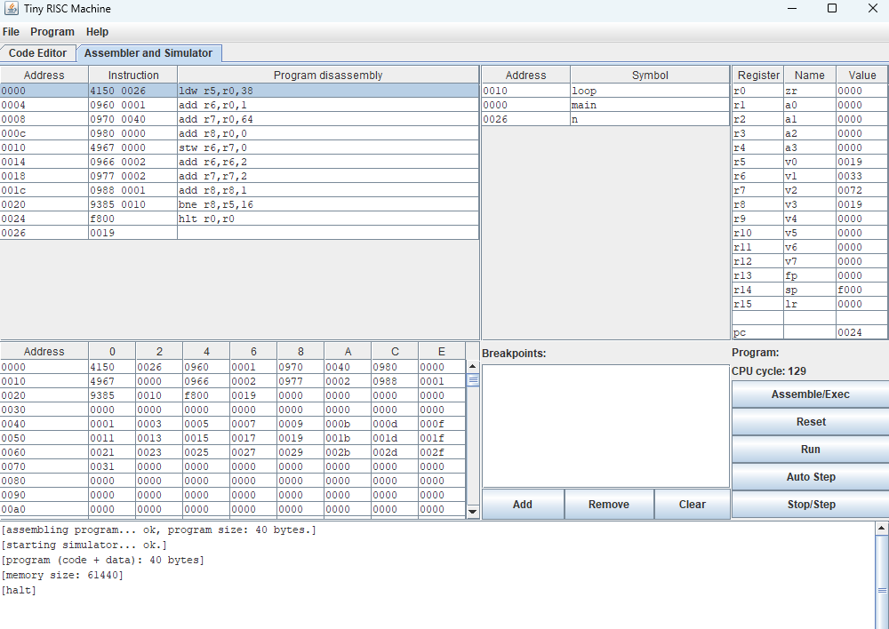
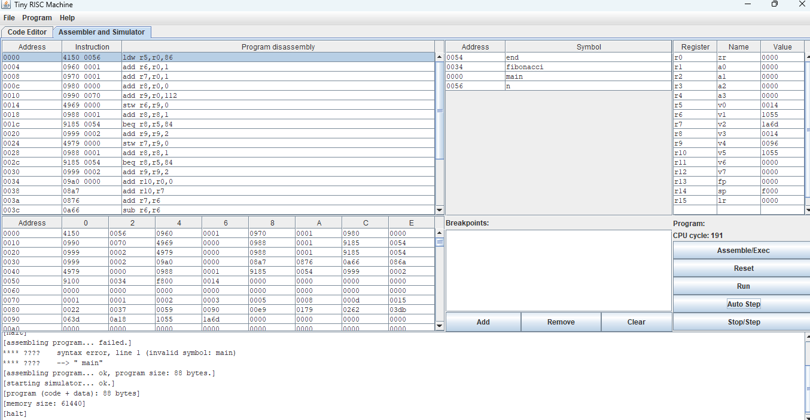
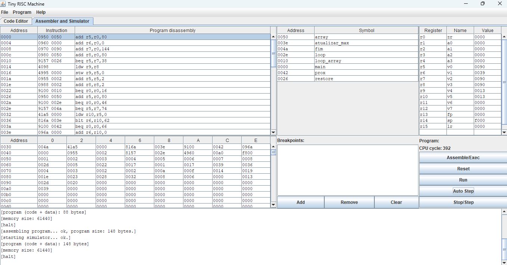
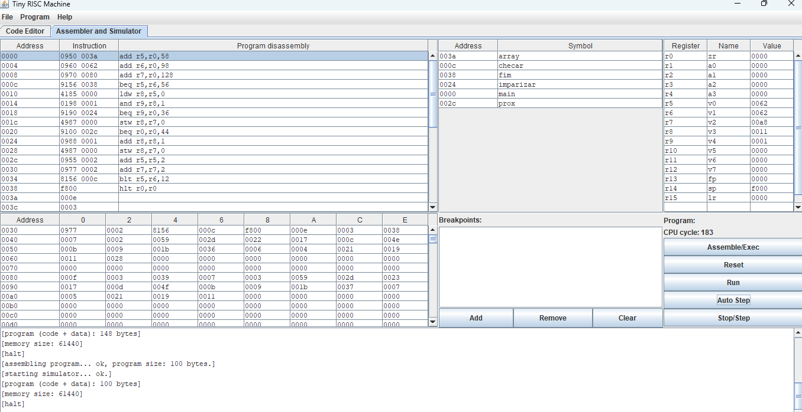
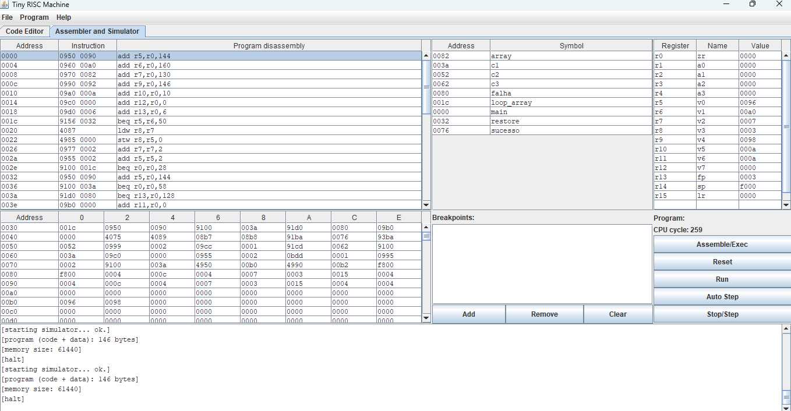
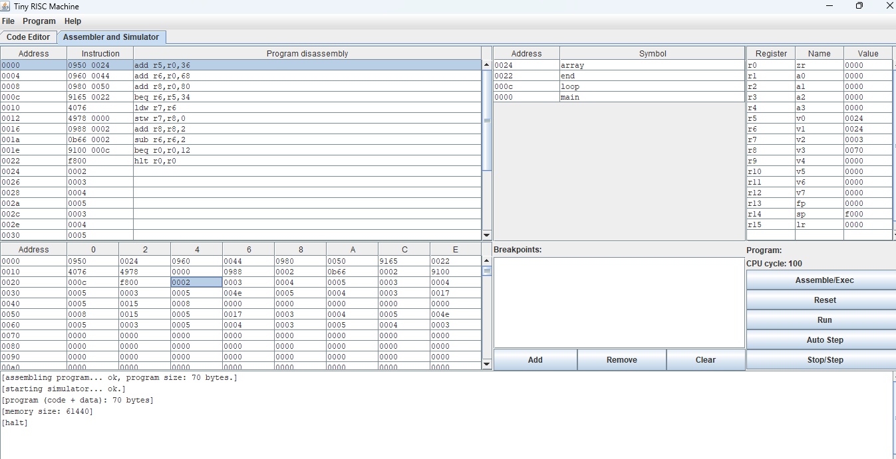
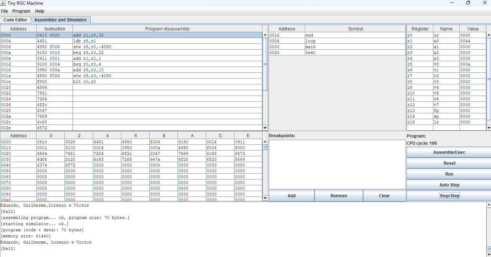
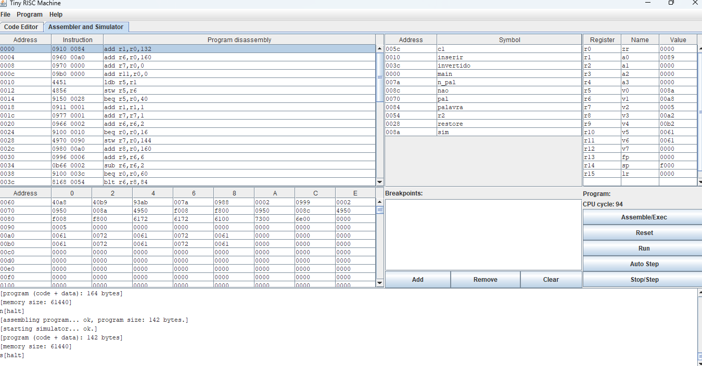
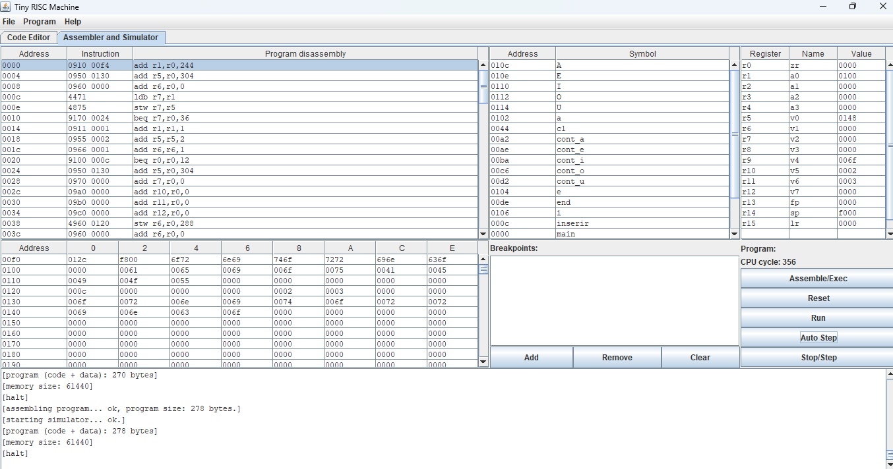

# T1-Fundamentos-de-Sistemas-Computacionais
PUCRS 
Prof. Anderson Domingues 

- O problema 7 foi desconsiderado.
## Autores
Guilherme Niemxeski Santos - 25101197 
Eduardo Pereira Duarte Demeneghi - 25105472 
Lorenzo Azevedo Borghetti - 25101929 
Victor Ribeiro Rodrigues Frade - 25103115 

# Problema 1:
### Enunciado:  

Desenvolva um programa que escreva na memória os N primeiros números inteiros ímpares maiores que zero. Seu programa deverá ser N da memória e funcionar para qualquer valor de N. Os valores deverão ser escritos a partir do endereço 0x20 e aparecerem contiguamente na memória.
 

### Explicação: 

Este programa calcula os N primeiros números ímpares maiores que zero e armazena-os sequencialmente na memória. Como o próprio código do programa ocupa os endereços iniciais da memória, foi escolhido o endereço 0x40 para iniciar a escrita dos resultados. Isso evita que o programa sobrescreva suas próprias instruções, o que poderia acontecer se um endereço anterior fosse utilizado. O programa lê o valor de N da memória para controlar um loop e, ao final da execução, a memória, a partir do endereço 0x40, conterá a sequência dos N primeiros números ímpares: 1, 3, 5, 7...
 

---

# Problema 2:
### Enunciado:

Desenvolva um programa capaz de gerar os N primeiros números da sequência de Fibonacci. Escreva cada número gerado na memória, a partir do endereço 0x30.
 

### Explicação: 

Este programa gera os N primeiros números da sequência de Fibonacci. O programa inicia tratando os dois primeiros termos (1 e 1) como casos base e, em seguida, entra num loop para calcular os termos subsequentes, somando os dois anteriores. Embora o enunciado original sugerisse um endereço mais baixo, o código utiliza o endereço 0x70. Essa escolha foi feita para garantir a segurança da execução, evitando sobrescrita de instruções. Ao final da execução, a memória conterá, a partir de 0x70, a sequência de Fibonacci: 1, 1, 2, 3, 5, 8, ...
 

---

# Problema 3:
### Enunciado: 

Escreva um programa para encontrar o maior número inteiro positivo escrito em memória entre os endereços 0x40 e 0x80. O número encontrado deverá ser escrito na posição 0x90.
 

### Explicação: 

A sua execução ocorre em duas fases principais: 

Fase de Preparação: Primeiro, o programa copia uma lista de números inteiros para os endereços 0x50 a 0x90. Criamos o nosso próprio conjunto de dados de teste na memória antes de iniciar a busca.
 

Fase de Busca: O programa percorre a região que acabou de preencher, comparando cada valor com o de uma variável que armazena o máximo encontrado até o momento, inicialmente zero. Se um número maior é lido, o valor máximo é atualizado.
 

Ao final da execução, o maior número de toda a sequência é armazenado no endereço de memória 0xa0. É importante notar que os endereços de memória utilizados pelo código (0x50 a 0x90 para os dados e 0xa0 para o resultado) diferem dos especificados no enunciado original, para não haver sobrescrita de instruções.
 

---

# Problema 4:
### Enunciado: 

Escreva um programa que lê todos os valores escritos em memória entre as posições 0x40 e 0x80 e os escreve a partir da posição 0x90, somando 1 aos valores pares para que se tornem ímpares. Assim, todos os 64 primeiros valores na memória a partir de 0x90 devem ser ímpares.
 

### Explicação: 

O algoritmo percorre os endereços 0x4c a 0x62, verificando cada número individualmente. Para determinar se um número é par ou ímpar, utiliza-se uma operação and. Se o resultado for 0 (indicando um número par), o valor é incrementado em 1; caso contrário, é mantido como está. O número resultante é então escrito numa área de memória de destino. Os resultados são escritos a partir do endereço 0x80, um escopo que difere do enunciado original mas que tem escalabilidade, se as posições de memória forem alteradas.
 

---

# Problema 5:
### Enunciado: 

Escreva um programa que procura entre os endereços 0x60 e 0x70 por dois números cuja soma seja igual a 10. Caso esses números existam, a posição deles deverá ser escrita nos endereços 0x80 e 0x90.
 

### Explicação: 

Há o carregamento automático do vetor na memória, mas ele é recopiado para uma posição de memória subsequente. Em seguida, é executado o algoritmo de busca, que utiliza um loop para testar a soma de cada par único de números nessa lista. Caso um par que some 10 seja encontrado, os endereços de memória desses dois números são escritos nas posições 0xb0 e 0xb2, e o programa termina. Se nenhum par correspondente for encontrado, o programa simplesmente para, não guardando nada nas posições 0xb0 e 0xb2.
 

---

# Problema 6:
### Enunciado: 

Escreva um programa que inverte a ordem dos valores compreendidos entre os endereços 0x40 e 0x60, isto é, os valores deverão aparecer "de trás pra frente" na memória. Você não deverá ler ou escrever em endereços de memória fora do intervalo entre 0x40 e 0x60.
 

### Explicação: 

O vetor, definido nas instruções, é inserido nas posições de memória 0x24 a 0x44. Há um ponteiro, já definido pelo preenchimento do vetor, ao seu final. Utiliza-se, então, esse ponteiro como base para o preenchimento do vetor invertido por meio de um loop, havendo o decremento desse ponteiro a cada execução. O vetor invertido começa a ser escrito na posição de memória 0x50.
 

---

# Problema 8:
### Enunciado: 

Escreva um programa que escreve seu nome completo na saída do simulador. Se estiver trabalhando com uma dupla, escreva o nome de ambos os alunos. Exemplos de escrita na saída do simulador podem ser encontrados na pasta exemplo.
 

### Explicação: 

A partir dos exemplos expostos e disponibilizados no Github, esse programa escreve o nome dos quatro integrantes do grupo na saída do simulador. Para tal fato ocorrer, primeiro adicionou-se o texto desejado (os nomes) à v0. Após isso, o caractere presente em a0 é carregado para v0. Esse ato, quando acabarem os caracteres fará com que a0 seja "igual" a zr. Logo, v0 nesse caso também será, o que levará à parte entitulada como "end". Caso ainda haja caracteres a serem carregados, o a0 irá primeiro escrever o caractere e depois partir para o próximo presente no text. Quando o programa é direcionado para o "end" primeiro ele gera um "espaçamento" para a visualização ocorrer de forma mais clara, por fim, coloca essa mudança no terminal, após isso o programa é encerrado.
 

---

# Problema 9:
### Enunciado: 

Escreva um programa que identifique se uma palavra é palíndrome. O número de caracteres na palavra deve ser lido do endereço 0x60 da memória, enquanto a palavra deve iniciar no endereço 0x70.
 

### Explicação: 

Primeiramente, a palavra é inserida nos endereços de memória 0xa0 em diante, dependendo do tamanho da palavra. Então, a palavra é copiada de forma invertida em um novo endereço de memória, que não sobrescreve a palavra normal devido a uma manipulação de ponteiros anterior a essa cópia. Em seguida, a palavra normal é comparada com a palavra invertida por meio de um loop, primeira posição com primeira posição, segunda com segunda, e assim até o fim da palavra. Há verificações a cada execução da comparação. Logo, se a primeira posição da palavra normal e da palavra invertida forem diferentes, o terminal mostrará a mensagem "n", para não é palíndromo. O mesmo ocorre para comparações seguintes. Caso cheguemos ao fim da palavra sem nenhuma diferença entre os elementos nas posições de memória dos dois ponteiros, o terminal exibe a mensagem "s", para é palíndromo. O número de caracteres é armazenado em 0x90. A palavra a ser testada pode ser mudada na área de dados, no bloco intitulado "palavra". A palavra teste, para o print abaixo, é "arara", apresentando o resultado "s".
 

---

# Problema 10:
### Enunciado: 

Escreva um programa que conta o número de cada vogal em uma palavra. O número de letras A, E, I, O e U devem ser escritos, respectivamente, nos endereços 0x40, 0x44, 0x48, 0x50 e 0x52. A palavra deve ser lida a partir do endereço 0x60. A quantidade de letras na palavra deve ser lida do endereço 0x58.
 

### Explicação: 

Primeiramente, o programa armazena a palavra a partir da posição 0x130, sem limite de tamanho. Então, a palavra é percorrida por um ponteiro e é checada a presença de vogais em cada posição de memória (letra) da palavra. Tanto letras maiúsculas, quanto minúsculas são checadas. O número de caracteres da palavra é armazenado em 0x120. As variáveis contadoras, do contador de A's ao contador de U's são armazenadas, respectivamente, em 0x124, 0x126, 0x128, 0x12a e 0x12c. A palavra usada no exemplo do print é "ornitorrinco", apresentando uma contagem de 2 I's e 3 O's. A palavra a ser analisada pode ser mudada na área de dados intitulada "palavra".
 

---

## Observações
- Na maioria dos problemas, a reorganização do endereço de memória pedido teve o intuito, sobretudo, de evitar a sobrescrita do hlt, o que geraria um loop infinito em alguns casos. 
